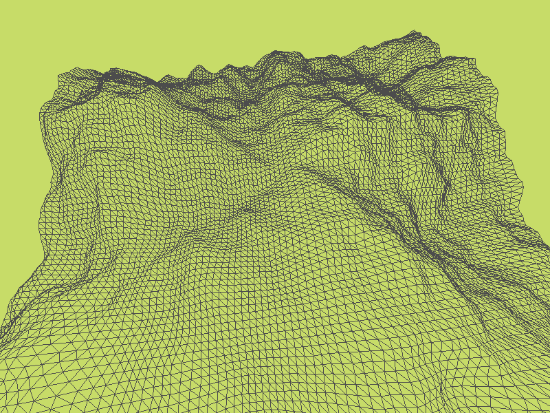

# DirectX 学习代码

- [d3d9](#direct3d-9-docs)
- [d3d11](#direct3d-11-docs)

## Direct3D 9 [docs](https://docs.microsoft.com/en-us/windows/win32/direct3d9/dx9-graphics)

### 固定管线渲染

使用 dx9 的固定管线渲染，我们可以实现**颜色绘制、光照模型、贴图绘制、颜色混合**，并可以利用**模板缓存**实现简单的**镜面**与**地面阴影**效果。

首先在一个窗口的基础上创建一个 dx9 设备。

要绘制一个 3D 物件，需要明确**绘制对象、摄像机、场景光源**这三要素。我们需要先设置好这些要素，再调用 `DrawPrimitive` 或 `DrawIndexedPrimitive` 完成绘制。

1. 绘制对象
   - 网格
     - 顶点信息
       - 位置、法线、颜色、贴图坐标、...
     - 索引信息
   - 变换信息
   - 材质
   - 贴图
2. 摄像机
   - 变换信息
3. 场景光源

具体怎么设置，看代码吧。

对于不同的绘制模式， dx9 允许使用 `SetRenderState` 、 `SetSamplerState` 等函数进行配置。

比如说，要进行颜色混合来绘制透明物体，需要启用混合并设置好混合因子。

**简单绘制**

|线框|实体|
|:-:|:-:|
|||

**颜色绘制**

**光照模型**，光源为竖直向下的方向光

|光照|+高光|
|:-:|:-:|
|||

**贴图绘制**

|贴图|+高光|
|:-:|:-:|
|||

**颜色混合**，要按照远近顺序依次绘制

|透明物体|调整绘制顺序实现的一种透视效果|
|:-:|:-:|
|||

#### 模板缓存

利用模板缓存可以实现一些特殊效果，模板缓存也是通过 `SetRenderState` 来进行配置。绘制特殊效果时，一般按照以下流程

1. 通过绘制特殊物体更新模板缓存，来指定有效的绘制区域
2. 设置好特殊效果所需的模板测试，以及其他参数
3. 设置特殊效果所需的额外变换，可以附加在世界变换的后面或取景变换的前面，并进行绘制
4. 恢复之前的设置

**镜面与地面阴影效果**

右侧白色平面为镜子，蓝色平面为地面。

#### 典型情景

学习基础知识后，现在我们可以面对实际应用中的问题，典型情景有：文本渲染、导入模型、外接体辅助判断、地形、粒子系统、物件的拾取。

**文本网格与外部模型**，使用 `D3DXCreateText` 生成文本网格

**外接体**，使用 `D3DXComputeBounding*` 计算获得

|AABB包围盒|包围球|
|:-:|:-:|
|||

**随机起伏地形**，使用柏林噪点生成

|线框|实体|
|:-:|:-:|
|||

**粒子效果**，绘制点精灵

|雪花 (67000+粒子)|烟花 (200+) 与 粒子枪 (5000+)|
|:-:|:-:|
|||

**拾取判断**

左下角与右下角的拾取点使茶壶变色

### 可编程管线渲染

可编程管线允许我们用自己写好的 shader 去替换固定管线中的部分功能。具体来说

- 顶点着色器
  - 替换变换与光照计算
- 像素着色器
  - 替换纹理颜色计算
- 未被替换
  - 裁剪，屏幕映射，片元采样，颜色混合

**shader 控制颜色**

**Phong 光照**

|漫反射|+高光|
|:-:|:-:|
|||
|||

**卡通渲染**，外扩背面顶点来描边

|角度1|角度2|
|:-:|:-:|
|||

**shader 控制贴图**

#### 效果框架

除了用 shader 替换固定管线的功能外，可编程管线也提供了效果框架（常用 `.fx` ）来定义手法与通道。效果框架就类似于渲染管线的 config 文件，按照文件所写的设置来进行渲染。其中手法用于区分不同的机器配置，通道用于多次渲染。

**雾效**

## Direct3D 11 [docs](https://docs.microsoft.com/en-us/windows/win32/direct3d11/atoc-dx-graphics-direct3d-11)

dx11 与 dx9 有很大的不同。

**第一**， dx11 没有固定渲染管线，许多功能直接由 shader 完成。 dx11 的渲染管线可以[在这](https://docs.microsoft.com/en-us/windows/win32/direct3d11/overviews-direct3d-11-graphics-pipeline)看到，简单叙述为 `IA -> VS -> HS -> DS -> GS -> RS -> PS -> OM` ， 在 `context` 接口中也能看到这些前缀。

**第二**， dx11 对功能做了分离，原本只需要一个 `device` 接口，现在被分离成了 `device,context,swap_chain` 三个接口。 `device` 负责创建资源，每个创建函数都是线程安全的； `context` 负责绘制，它不是线程安全的，但可以让每个线程拥有一个 `delay context` 来记录绘制命令，之后递交主线程 `immediate context` 完成最终绘制； `swap_chain` 属于 [dxgi](https://docs.microsoft.com/en-us/windows/win32/direct3ddxgi/dx-graphics-dxgi) ，它保留多个缓冲区域，并将这些缓冲区域轮换刷新到屏幕上。

**第三**， dx11 的渲染目标不直接绑定到屏幕缓冲。如第二点所说，屏幕缓冲由 `swap_chain` 负责，要想让 `context` 绘制到屏幕上，则需要用屏幕缓冲创建 `view` 资源，再对 `context` 设置相应渲染目标。

**第四**， dx11 弃用了 d3dx 实用库，如需使用数学，需要 `#include <DirectXMath.h>` ； dx11 还不再直接支持效果框架，官方对这部分进行了开源，如需使用需要自己编译。

另外，可以 `#include <wrl/client.h>` 来使用组件的智能指针 `Microsoft::WRL::ComPtr< >` 。

### 基本流程

在创建完基本设施（设备、上下文、交换链）后，明确下面三要素便可完成绘制

1. **绘制对象**
   - 网格
     - 顶点信息
     - 索引信息
   - 变换信息
   - 材质
     - vertex shader
     - pixel shader
     - shader 所需的颜色值、贴图等资源
     - ...
   - 渲染信息
     - 背面消隐
     - 颜色混合
     - 模板测试
     - ...
2. **摄像机**
   - 变换信息
   - 采样信息
   - 渲染目标
3. **其它对渲染产生影响的要素**
   - 场景光源

绘制对象的变换信息、摄像机的变换信息、其它对渲染产生影响的要素，这三部分其实是发送给 shader 作为参数的。直接设置到上下文的只有网格信息、材质、渲染信息、采样信息、渲染目标；网格信息对应 `IA` ，材质对应各个 shader ，渲染信息、采样信息、渲染目标对应 `RS,OM` 。

为了与 shader 进行数据交互，还需要额外创建常量缓存区，变换信息、颜色、光照等都需要写入常量缓存区。这个常量缓存区一般创建为动态可写缓存区，大小需对齐到 16 byte 。

<!--
### 光照

### 贴图

### 混合技术

### 模板技术

### 曲面细分技术
--->
