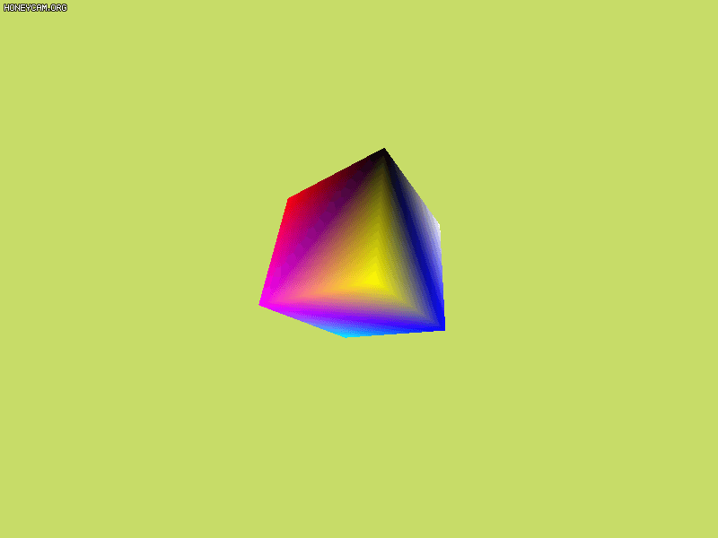
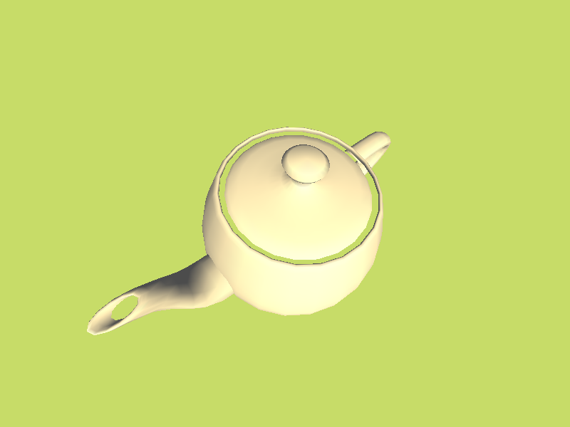

# DirectX 学习代码

- [d3d9](#direct3d-9-docs)
- [d3d11](#direct3d-11-docs)
- [d3d12](#direct3d-12-docs)

## Direct3D 12 [docs](https://docs.microsoft.com/en-us/windows/win32/direct3d12/direct3d-12-graphics)

dx12 被完全地重新设计， dx11 中为了过渡还保留了一些旧的东西，而 dx12 则完全抛弃了那些，变得更加底层。

### 预备

**COM** ：组件对象模型。

**[dxgi](https://docs.microsoft.com/en-us/windows/win32/direct3ddxgi/dx-graphics-dxgi)** ：交换链、显示模式、适配器、屏幕都归它管。

**交换链**

**纹理资源与数据格式**：统一为 `DXGI_FORMAT` 枚举类型。

**描述符**： dx 资源存储在显存，本质上为内存块，描述符告诉 gpu 如何理解和使用这个内存块，描述符（descriptor）与视图（view）是同义词，本身不含有资源；部分描述符存储在描述符堆中。

**资源驻留**： dx12 允许应用程序主动管理显存中的资源驻留情况。

**资源状态与转换**：资源状态由枚举量 `D3D12_RESOURCE_STATES` 标识，资源状态原本是驱动的活， dx12 交由软件层管理，通过递交 `resource barrier` 命令可完成转换。

**功能检测**： `CheckFeatureSupport` 检查所有功能是否被支持。

**功能级别**

**深度缓冲**

**多重采样**： SSAA 超级采样是指对单一像素多次采样与计算颜色，而 MSAA 多重采样仅多次采样，颜色计算只进行一次。但是， dx12 不支持直接创建 MSAA 的交换链。 alpha to coverage 选项可让 dx12 用 alpha 值代替采样计算覆盖性。

**命令列表**：我们通过递交命令来让 gpu 帮我们做事。 gpu 有一个 `command queue` ，它会依次执行其中的命令，我们用 cpu 创建 `command list` 打包好命令，然后提交到 gpu 队列中去；
这种交互方法代替了 dx11 中的 `context` ， `command list` 不是线程安全的，我们可以用多个线程创建很多 `command list` ，然后递交到同一个 `command queue` 中。
然而这两个东西都只保留命令的引用，命令实际存储在 `command allocator` 中，提交命令也只是将引用交给队列； `command allocator` 创建新命令不是线程安全的，
所以，要么不同时使用两个 `command list`  记录命令，要么创建多个 `command allocator` ；
由于 gpu 队列也引用 `command allocator` 的命令，因此不能随意重置 `command allocator` 。

**cpu gpu 同步**：命令会引用一些资源与数据，在 gpu 执行命令前， cpu 修改了它，便会产生问题；我们暂时使用 `fense` 来让 cpu 等待 gpu 完成所有命令这种粗暴的方法。

### 初始化

1. 创建基础设施
   1. 创建设备 `ID3D12Device`
   2. 创建 `ID3D12Fence` 用于同步 cpu 与 gpu
   3. 创建命令列表 `ID3D12CommandQueue` `ID3D12CommandAllocator` `ID3D12GraphicsCommandList`
   4. 创建交换链 `IDXGISwapChain` ，其中包含了用于渲染的屏幕资源
2. 创建基础资源
   1. 创建描述符堆 `ID3D12DescriptorHeap` ，分别用于渲染目标 RTV 、深度模板缓存 DSV 、常量缓存等 CBV,SRV,UAV
   2. 创建 RTV 、深度模板资源与 DSV 、常量缓存与 CBV
   3. 存储视口 `D3D12_VIEWPORT` 、裁切矩阵
3. 初始化
   1. 创建根签名 `ID3D12RootSignature` ，我们通过它绑定资源到渲染流水线上
   2. 创建流水线状态对象（PSO） `ID3D12PipelineState` ，我们通过它绑定输入布局、着色器等信息
   3. 创建用于渲染的更多资源，包括顶点缓存、索引缓存

### 渲染流水线

dx12 的**渲染管线**可以[在这](https://docs.microsoft.com/en-us/windows/win32/direct3d12/pipelines-and-shaders-with-directx-12)看到，其延续了 dx11 ，可以简述为 `IA -> VS -> HS -> TS -> DS -> GS -> RS -> PS -> OM` 。

其中各 shader 阶段均通过 PSO 设置 shader 代码，并借由根签名将资源映射到 shader 的输入寄存器。 PSO 还设置了 IA 的输入布局、 RS 的光栅化参数、 OM 的混合参数、深度模板参数。

1. 开始阶段
   1. 同步 cpu 与 gpu
   2. 重置命令列表 `Reset`
   3. 转换屏幕资源状态为 `D3D12_RESOURCE_STATE_RENDER_TARGET`
   4. 清屏 `ClearRenderTargetView` `ClearDepthStencilView`
   5. 设置渲染目标 `OMSetRenderTargets`
   6. 设置视口与裁切矩阵 `RSSetViewports` `RSSetScissorRects`
2. 布局阶段
   1. 设置其它描述符堆 `SetDescriptorHeaps` 并 `Map` cbuffer
   2. 设置根签名 `SetGraphicsRootSignature`
   3. 向全局 cbuffer 写入数据并设置到流水线 `SetGraphicsRootDescriptorTable`
   4. 设置 PSO `SetPipelineState`
3. 绘制阶段
   1. 设置图元拓扑 `IASetPrimitiveTopology`
   2. 设置顶点缓存 `IASetVertexBuffers`
   3. 设置索引缓存 `IASetIndexBuffer`
   4. 向物品 cbuffer 写入数据并设置到流水线 `SetGraphicsRootDescriptorTable`
   5. 绘制 `DrawInstanced` 或 `DrawIndexedInstanced`
4. 结束阶段
   1. `Unmap` cbuffer
   2. 转换屏幕资源状态为 `D3D12_RESOURCE_STATE_PRESENT`
   3. 递交命令给 gpu `Close` `ExecuteCommandLists`
   4. 更新交换链 `Present`

### 1 基础立方体

### 组织架构

**帧资源**：我们可以将单一帧 gpu 所引用到的资源捆绑到一个类中，简单情形会包括一个 `command allocator` 和常量缓存，如此一来，我们不需要等 gpu 完成后再创建新命令，而是直接使用新的帧资源创建新命令，这样， gpu 引用的资源便不会发生改变。当 cpu 性能足够时，我们可以保证 gpu 处于时刻运转的状态，最大化 gpu 的性能。实际操作中，一般使用一个环形数组。

**常量缓存区**：在 shader 中会使用 `cbuffer xxx : register(bn)` 来使用多个常量缓存区；而且对于不同的物体，上传的数据应出现在常量缓存区的不同位置。为了方便，我们可以将常量缓存区封装成类，实质上是一个上传缓冲区，对外有 `CopyData` 函数。

**网格，物件**：对于图元拓扑、顶点缓存、索引缓存，可以封装为网格。而网格、变换、材质则可以封装为物件。

**PSO - 物件列表**：设置 PSO 到物件列表的字典，可最小化切换 PSO 的次数，同时也支持单一物件在多个 PSO 下重复渲染，以实现一些复杂效果。

### 2 线框场景

### 根签名

在现代的可编程管线中，绝大多数资源都是要绑定到 shader 上，由 shader 来决定如何使用的，我们使用根签名定义这些资源如何映射到着色器的输入寄存器。

在 dx12 的命令列表的函数接口中，会发现只有两个特例。第一个是顶点缓存和索引缓存资源，这俩的描述符直接设置到 IA 阶段，但需要在 PSO 中设置对应的输入布局。第二个是 RTV 和 DSV ，虽然需要存储在相应的堆上，但却是直接设置到 OM 阶段。

说回根签名，根签名的官方文档在[这里](https://docs.microsoft.com/en-us/windows/win32/direct3d12/root-signatures)。根签名包含一系列的根参数，根参数的类型有三种

1. 描述符表 DT ：引用描述符堆中的一块连续范围。例如我们可以通过 DT 将描述符堆上连续的 5 个描述符分别映射到 `(b0,b1,b2,t0,u2)` 。由于 DT 描述的为连续范围，因此有必要安排好描述符堆中的位置排布。
2. 描述符 CBV,SRV,UAV ：不需要存储它到堆上，直接绑定资源到管线上，但只接受一维的缓冲区资源。通过 `SetGraphicsRoot*View` 直接设置资源位置。
3. 常量 Constant

根参数最大为 64 DWORD ，其中描述符表占用 1 DWORD ，描述符占用 2 DWORD ，常量每 32 bit 占用 1 DWORD 。性能上常量优于描述符优于描述符表，但根参数在根签名位置越靠后，性能越差，因此应使用较小的根签名，同时应将变更频率高的放在前面。

我们创建的资源，会在描述符堆上创建相应的描述符，然后通过根签名映射到输入寄存器，最后被 PSO 上设置的 shader 所使用；每一个环节都需要考虑它们的匹配情况。

### 3 光照

我们用漫反射反照度 $A_D$ 、透明度、菲涅尔反射比 $R_F(0)$ 、粗糙度 $R$ 、自发光描述一个材质。光照包含环境光、光源漫反射、光源镜面反射。对每一顶点/像素计算出光照强度 $I$ 、入射反向量 $L$ 、法线 $N$ 、视线反向量 $V$ 、微观法线 $H$ 。

$$
\begin{align}
   \text{color} &= \text{ambient} + \sum_{\text{light}} (\text{diffuse} + \text{specular}) + \text{emissive} \\
   \text{ambient} &= I \cdot A_D \\
   \text{diffuse} &= \cos \theta_i \cdot I \cdot A_D \\
   \text{specular} &= \cos \theta_i \cdot I \cdot R_F(\theta_h) \cdot F_S \\
   R_F(\theta_h) &= R_F(0) + (1 - R_F(0)) \cdot (1-\cos\theta_h)^5 \\
   m &= (1 - R) \cdot 256 \\
   F_S &= \frac{m+8}{8} \cos^m \theta_{ih}
\end{align}
$$

$\theta_i$ 为宏观入射角， $\theta_h$ 为微观入射角， $F_S$ 为镜面反射基于粗糙度的反射因子，$\theta_{ih}$ 为微平面与宏观表面的夹角。

|基于顶点|基于像素|
|:-:|:-:|
|||

### 4 贴图

使用贴图为不同的像素提供不同的材质、法线等信息。除了贴图，还需要指定采样器，采样器定义了过滤方式与寻址模式。

|开灯|关灯|
|:-:|:-:|
|||

### 5 混合

按透明度混合，需要注意前后绘制顺序。大量的物体进行排序按透明度混合时，混合本身会增加处理负担，同时也会产生大量的重复绘制，进一步增加性能开销。

### 6 更多 shader

|公告牌技术|曲面细分技术|
|:-:|:-:|
|||

### 工作流程

为了达到某种渲染效果，或利用 GPU 做某种计算。

首先，需要想好我们的主要逻辑，即 shader 需要哪些资源，据此设计创建根签名；并对不同的 pass 创建相应的 PSO 。

然后，创建实际存在的资源，这些资源存放在显存，可以以纹理、缓冲区等形式存在，作为输入的资源，需利用上传堆从内存拷贝到显存，作为结果的资源，需利用回读堆拷贝到内存；接着在描述符堆上创建描述符，描述符有 CBV 、 SRV 、 UAV ，不同种类的描述符提供不同的访问方式与权限，也绑定不同的寄存器。

最后，按照设计好的逻辑，上传更新的内存数据；绑定根签名、 PSO 、描述符堆；转换资源状态；设置根参数，即各种资源描述符；图形管线额外设置 IA 与 OM 的描述符；调用核心工作函数 `Drawxxx` 或 `Dispatch` ；回读结果的显存数据。

在 shader 中，可以通过 `Texture` 访问纹理资源，或通过 `RWStructuredBuffer` `ConsumeStructuredBuffer` `AppendStructuredBuffer` 等访问缓冲区，具体可参照 [HLSL 数据类型](https://docs.microsoft.com/en-us/windows/win32/direct3dhlsl/dx-graphics-hlsl-data-types)的页面。对于计算着色器，可以使用 `groupshared float4 group_cache[256];` 连接线程组的共享内存。

## Direct3D 11 [docs](https://docs.microsoft.com/en-us/windows/win32/direct3d11/atoc-dx-graphics-direct3d-11)

dx11 与 dx9 有很大的不同。

**第一**， dx11 没有固定渲染管线，许多功能直接由 shader 完成。 dx11 的渲染管线可以[在这](https://docs.microsoft.com/en-us/windows/win32/direct3d11/overviews-direct3d-11-graphics-pipeline)看到，简单叙述为 `IA -> VS -> HS -> DS -> GS -> RS -> PS -> OM` ， 在 `context` 接口中也能看到这些前缀。

**第二**， dx11 对功能做了分离，原本只需要一个 `device` 接口，现在被分离成了 `device,context,swap_chain` 三个接口。 `device` 负责创建资源，每个创建函数都是线程安全的； `context` 负责绘制，它不是线程安全的，但可以让每个线程拥有一个 `delay context` 来记录绘制命令，之后递交主线程 `immediate context` 完成最终绘制； `swap_chain` 属于 [dxgi](https://docs.microsoft.com/en-us/windows/win32/direct3ddxgi/dx-graphics-dxgi) ，它保留多个缓冲区域，并将这些缓冲区域轮换刷新到屏幕上。

**第三**， dx11 的渲染目标不直接绑定到屏幕缓冲。如第二点所说，屏幕缓冲由 `swap_chain` 负责，要想让 `context` 绘制到屏幕上，则需要用屏幕缓冲创建 `view` 资源，再对 `context` 设置相应渲染目标。

**第四**， dx11 弃用了 d3dx 实用库，如需使用数学，需要 `#include <DirectXMath.h>` ； dx11 还不再直接支持效果框架，官方对这部分进行了开源，如需使用需要自己编译。

另外，可以 `#include <wrl/client.h>` 来使用组件的智能指针 `Microsoft::WRL::ComPtr< >` 。

### 基本流程

在创建完基本设施（设备、上下文、交换链）后，明确下面三要素便可完成绘制

1. **绘制对象**
   - 网格
     - 顶点信息
     - 索引信息
   - 变换信息
   - 材质
     - vertex shader
     - pixel shader
     - shader 所需的颜色值、贴图等资源
     - ...
   - 渲染信息
     - 背面消隐
     - 颜色混合
     - 模板测试
     - ...
2. **摄像机**
   - 变换信息
   - 采样信息
   - 渲染目标
3. **其它对渲染产生影响的要素**
   - 场景光源

绘制对象的变换信息、摄像机的变换信息、其它对渲染产生影响的要素，这三部分其实是发送给 shader 作为参数的。直接设置到上下文的只有网格信息、材质、渲染信息、采样信息、渲染目标；网格信息对应 `IA` ，材质对应各个 shader ，渲染信息、采样信息、渲染目标对应 `RS,OM` 。

为了与 shader 进行数据交互，还需要额外创建常量缓存区（ `bn` ），变换信息、颜色、光照等都需要写入常量缓存区。这个常量缓存区一般创建为动态可写缓存区，并要特别注意 hlsl 的内存优先顺序与对齐方案。而纹理则是使用纹理寄存器（ `tn` ）。

### 基础立方体

### 光照

通过常量缓存区传递数据，在 shader 中计算光照下的颜色。

|方向光|方向光+点光源|点光源|
|:-:|:-:|:-:|
||||

### 贴图

通过纹理寄存器设置纹理，在 shader 中获取纹理颜色。

### 混合与模板

在 `OM` 阶段设置混合状态与深度模板状态，在 `RS` 阶段设置光栅化状态。

|透明|镜面|
|:-:|:-:|
|||

### 应用: 导入 .obj 模型与卡通渲染

| .obj | cartoon |
|:-:|:-:|
|||

## Direct3D 9 [docs](https://docs.microsoft.com/en-us/windows/win32/direct3d9/dx9-graphics)

### 固定管线渲染

使用 dx9 的固定管线渲染，我们可以实现**颜色绘制、光照模型、贴图绘制、颜色混合**，并可以利用**模板缓存**实现简单的**镜面**与**地面阴影**效果。

首先在一个窗口的基础上创建一个 dx9 设备。

要绘制一个 3D 物件，需要明确**绘制对象、摄像机、场景光源**这三要素。我们需要先设置好这些要素，再调用 `DrawPrimitive` 或 `DrawIndexedPrimitive` 完成绘制。

1. 绘制对象
   - 网格
     - 顶点信息
       - 位置、法线、颜色、贴图坐标、...
     - 索引信息
   - 变换信息
   - 材质
   - 贴图
2. 摄像机
   - 变换信息
3. 场景光源

具体怎么设置，看代码吧。

对于不同的绘制模式， dx9 允许使用 `SetRenderState` 、 `SetSamplerState` 等函数进行配置。

比如说，要进行颜色混合来绘制透明物体，需要启用混合并设置好混合因子。

**简单绘制**

|线框|实体|
|:-:|:-:|
|||

**颜色绘制**

**光照模型**，光源为竖直向下的方向光

|光照|+高光|
|:-:|:-:|
|||

**贴图绘制**

|贴图|+高光|
|:-:|:-:|
|||

**颜色混合**，要按照远近顺序依次绘制

|透明物体|调整绘制顺序实现的一种透视效果|
|:-:|:-:|
|||

#### 模板缓存

利用模板缓存可以实现一些特殊效果，模板缓存也是通过 `SetRenderState` 来进行配置。绘制特殊效果时，一般按照以下流程

1. 通过绘制特殊物体更新模板缓存，来指定有效的绘制区域
2. 设置好特殊效果所需的模板测试，以及其他参数
3. 设置特殊效果所需的额外变换，可以附加在世界变换的后面或取景变换的前面，并进行绘制
4. 恢复之前的设置

**镜面与地面阴影效果**

右侧白色平面为镜子，蓝色平面为地面。

#### 典型情景

学习基础知识后，现在我们可以面对实际应用中的问题，典型情景有：文本渲染、导入模型、外接体辅助判断、地形、粒子系统、物件的拾取。

**文本网格与外部模型**，使用 `D3DXCreateText` 生成文本网格

**外接体**，使用 `D3DXComputeBounding*` 计算获得

|AABB包围盒|包围球|
|:-:|:-:|
|||

**随机起伏地形**，使用柏林噪点生成

|线框|实体|
|:-:|:-:|
|||

**粒子效果**，绘制点精灵

|雪花 (67000+粒子)|烟花 (200+) 与 粒子枪 (5000+)|
|:-:|:-:|
|||

**拾取判断**

左下角与右下角的拾取点使茶壶变色

### 可编程管线渲染

可编程管线允许我们用自己写好的 shader 去替换固定管线中的部分功能。具体来说

- 顶点着色器
  - 替换变换与光照计算
- 像素着色器
  - 替换纹理颜色计算
- 未被替换
  - 裁剪，屏幕映射，片元采样，颜色混合

**shader 控制颜色**

**Phong 光照**

|漫反射|+高光|
|:-:|:-:|
|||
|||

**卡通渲染**，外扩背面顶点来描边

|角度1|角度2|
|:-:|:-:|
|||

**shader 控制贴图**

#### 效果框架

除了用 shader 替换固定管线的功能外，可编程管线也提供了效果框架（常用 `.fx` ）来定义手法与通道。效果框架就类似于渲染管线的 config 文件，按照文件所写的设置来进行渲染。其中手法用于区分不同的机器配置，通道用于多次渲染。

**雾效**

